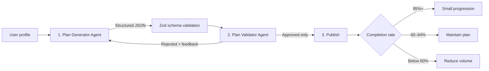

# FormFlow AI Training Plan

Kullanıcı profiline göre haftalık antrenman planı üreten, planı **ayrı bir validator agent** ile kontrol eden ve yalnızca onaylanmış planı yayınlayan gösterilebilir bir multi-agent Next.js uygulaması. Haftalık tamamlanma oranı seçildiğinde bir sonraki hafta ayrıca adapte edilir.

## Workflow



Generator en fazla iki revizyon yapar (ilk üretim + 2 yeniden üretim). Pipeline durumları arayüzde **Generating → Validating → Revising → Published → Adapted** olarak görünür.

## Agent'lar

- **Plan Generator Agent** (`lib/agents/generator.ts`): Hedef, seviye, gün sayısı, süre, ekipman ve kısıtlamadan yapılandırılmış plan üretir. Validator geri bildirimini sonraki denemede bağlama ekler.
- **Plan Validator Agent** (`lib/agents/validator.ts`): Süre, ekipman, fiziksel kısıt, alanların eksiksizliği ve haftalık gün sayısını bağımsız olarak kontrol eder; gerekçeli red döndürür.
- **Publish / Adapt Agent** (`lib/agents/adapter.ts`): Yalnızca route tarafından onaylanan plana uygulanır. `%100` için küçük ilerleme, `%70` için koruma, `%40` için hacim/süre azaltımı yapar.
- **Orchestrator** (`app/api/plan/route.ts`): Agent'ları sırayla çağırır, feedback/revision döngüsünü sınırlar ve reddedilmiş planın yayınlanmasını engeller.

## Lokal çalıştırma

```bash
npm install
npm run dev
```

Ardından [http://localhost:3000](http://localhost:3000) adresini açın. Kalite kontrolleri:

```bash
npm run lint
npm run build
```

## Environment variables

`.env.local` örneği:

```env
OPENAI_API_KEY=sk-...
OPENAI_MODEL=gpt-4.1-mini
```

`OPENAI_API_KEY` varsa Generator gerçek OpenAI Responses API ve strict JSON Schema çıktısını kullanır. Anahtar yoksa aynı Zod sözleşmesine uyan **deterministik demo fallback** otomatik devreye girer. Böylece kurulumda harici servis veya hesap olmadan tüm üretme, doğrulama, yayınlama ve adaptasyon akışı değerlendirilebilir.

## Failure autopsy

### Olay

Validator çalışmadan yayınlanan uzun bir plan, örnek kullanıcının **45 dakikalık seans sınırını aşıyordu**. Plan görünüşte kapsamlı olsa da kullanıcının gerçek zaman bütçesine uymuyor ve uygulanabilir değildi.

### Kök neden

Generator çıktısına doğrudan güvenilmişti. Yapılandırılmış görünmesi, çıktının süre, ekipman ve fiziksel kısıtlara gerçekten uyduğu anlamına gelmiyordu. Üretim ve yayınlama arasında bağımsız bir kalite kapısı yoktu.

### Düzeltme

1. Generator'dan ayrı çalışan **Plan Validator Agent** eklendi.
2. Agent sınırlarında **Zod şema kontrolü** zorunlu hale getirildi.
3. Red gerekçelerini Generator'a geri veren, **en fazla iki yeniden üretimli revision döngüsü** eklendi.
4. Orchestrator yalnızca `approved: true` planları **Published Plan** alanına geçiriyor; üç deneme de başarısızsa HTTP 422 ile yayınlamayı reddediyor.

Bu katmanlar biçimsel doğruluğu, iş kurallarını ve yayınlama yetkisini birbirinden ayırır; aynı hatanın sessizce kullanıcıya ulaşmasını önler.
